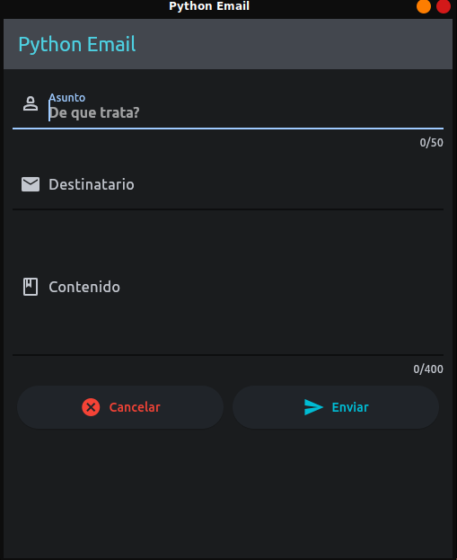

# Python Email
una aplicación simple para enviar correos



## Instalación
Debes tener:
* Python 3.x
* flet ^0.18

```
pip install flet
```

## Ejecutar
En la terminal ejecuta este comando:

```
flet run 
```

> [!IMPORTANT]
> Debes tener un archivo .env donde esten las variables como tu email y la contraseña del email <br>
[Aquí puedes crear una contraseña de aplicación en gmail](https://myaccount.google.com/u/4/apppasswords)

Asi debe ser el `.env`:
```dosini
EMAIL="tuemail@gmail.com"
PASSWORD_EMAIL="tucontraseña"
```